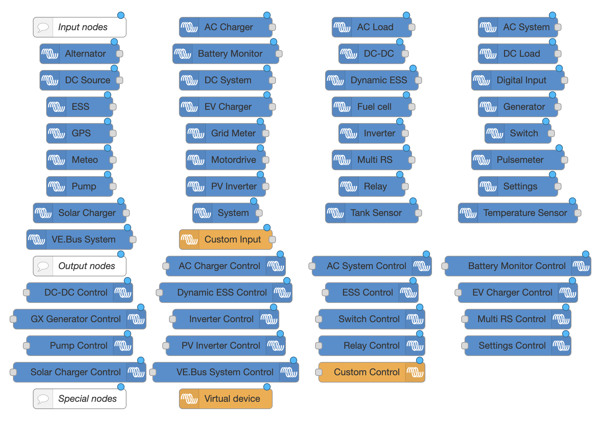

# User Guide for Victron Energy Nodes

## Overview
The Victron Energy nodes for Node-RED provide an intuitive interface for interacting with your Victron system. These nodes allow you to monitor and control various Victron devices through Node-RED's visual programming interface.

## Available Nodes



### Input Nodes
Input nodes allow you to read data from your Victron devices.


#### Configuration Options
- **Device Select**: Choose from available Victron devices
- **Measurement Select**: Choose what to measure from the selected device
- **Node Label**: Optional custom name for the node

The measurement unit appears in brackets (e.g., "Battery voltage (V)"). For enumerated values, you'll see a legend below the selection.

### Output Nodes
Output nodes let you control Victron devices.


#### Configuration Options
- **Device Select**: Choose which device to control
- **Measurement Select**: Available control options for the device
- **Initial Value**: Value to set when Node-RED starts
- **Node Label**: Optional custom name for the node


### Virtual Devices
Virtual devices create simulated Victron devices on the system, which
will appear on VRM.

At the moment there are several different virtual devices available,
including battery, grid meter, temperature sensor, pv inverter switch
and meteo.
Check the documentation of the node itself for more info.

#### Virtual Device Usage
1. Add a virtual device node to your flow
2. Configure the device type and parameters
3. Deploy the flow
4. Use standard input/output nodes to interact with the virtual device

#### Virtual Device Persistence

Virtual devices automatically persist their latest values to disk to maintain state across Node-RED restarts. The system stores the most recent values of D-Bus paths in JSON files on the underlying storage.

##### Configuration

You can configure the persistence location in three ways (listed in order of precedence):

###### 1. Configuration File
Set the location in your configuration file under `victronVirtual` → `persistLocation`:

```javascript
victronVirtual: {
    persistLocation: '/data/home/nodered/.node-red/.victron'
}
```

###### 2. Environment Variable
If not set in the configuration file, the system checks for the `PERSISTED_STATE_LOCATION` environment variable.

###### 3. Default Location
If neither option above is configured, the system falls back to Node-RED's settings `userDir` appended with `/.victron`.

##### How It Works

- Each virtual device node creates its own JSON file in the configured directory
- State values are automatically saved when they change
- On Node-RED startup or restart, these files are read and the stored values are restored to the D-Bus

This ensures your virtual devices maintain their last known state even after system restarts or power cycles.

##### Disk Wear Protection

To prevent excessive wear on the underlying disk, some values use a threshold-based storage system. Instead of writing to disk on every change, these values are only persisted once per x seconds, reducing the frequency of disk writes while still maintaining state persistence.
This ensures your virtual devices maintain their last known state even after system restarts or power cycles.

## Best Practices

1. **Node Naming**
   - Use clear, descriptive names for nodes
   - Include the measurement type in the name
   - Consider adding the device identifier for multiple similar devices

2. **Flow Organization**
   - Group related nodes together
   - Use link nodes for complex flows
   - Add comment nodes to explain logic

3. **Error Handling**
   - Add catch nodes for error handling
   - Validate data before sending to output nodes
   - Consider adding status nodes for monitoring

4. **Performance**
   - Avoid polling too frequently
   - Use triggers for state changes
   - Consider using the context store for frequently accessed values

## Troubleshooting

### Common Issues

1. **Nodes show "not connected"**
   - Check D-Bus connection
   - Verify device is powered on
   - Confirm network connectivity

2. **Values not updating**
   - Check node configuration
   - Verify measurement selection
   - Confirm device is sending data

3. **Cannot write to device**
   - Verify write permissions
   - Check device lock status
   - Confirm value format is correct

### Getting Help
If you encounter issues:
1. Check the debug tab in Node-RED
2. Review the Venus OS logs
3. Visit the [Victron Community Forum](https://community.victronenergy.com)
4. Submit an issue on GitHub

## Additional Resources

- [Example Flows](https://github.com/victronenergy/node-red-contrib-victron/wiki/Example-Flows)
- [API Documentation](./API.md)
- [Installation Guide](./INSTALL.md)
- [Venus OS Documentation](https://www.victronenergy.com/live/venus-os:large)
